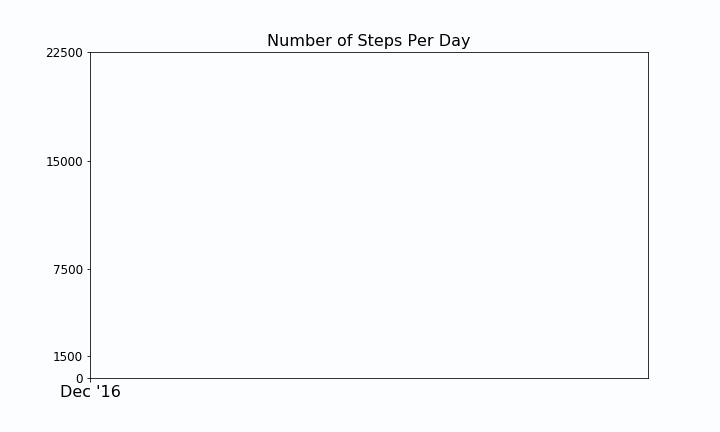
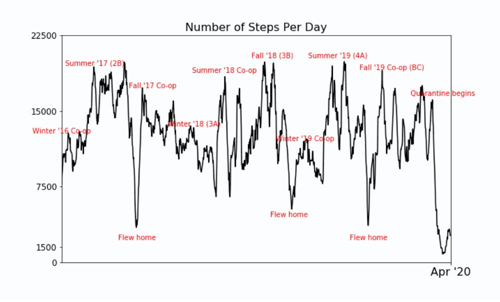

# Parsing and Plotting Step Count from Apple Data
This program parses the Apple Health XML data file downloadable from Apple to extract the daily step count. This data is then plotted to visualize any trends and correlations with life events.

  
  

